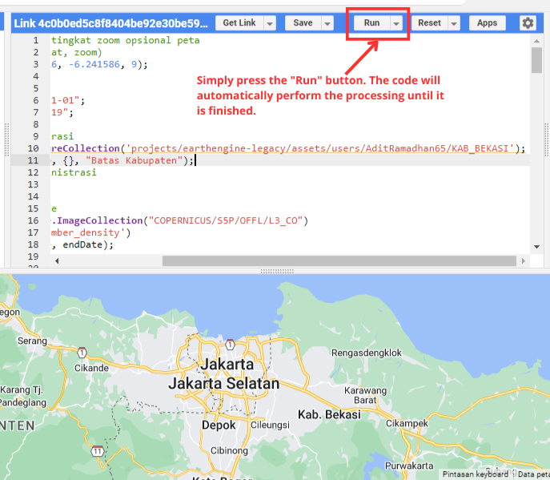

<main>
  <article>
    <header>
      <h1>Air Quality Map In Jabodetabek Google Earth Engine</h1>
    </header>
    

      Air quality describes how clean or polluted the air is. It's crucial for
      health and the environment since clean air means freedom from harmful
      substances. Pollutants, monitoring, standards, and the Air Quality Index
      (AQI) all impact air quality. AQI reports daily air quality, with higher
      values indicating more pollution and potential health risks. Various land,
      sea, and satellite instruments help monitor air quality, set standards,
      and report the AQI.
    

    

      The direction of this map development is to produce an
      <strong>Air Quality Index (AQI) map</strong> that covers all of Indonesia,
      not just Jabodetabek. However, this cannot be done quickly and requires
      time to research whether this is possible in the Google Earth Engine
      application. To change the map coverage, simply import a shp file of
      Indonesia's boundaries and slightly change some of the directory code
      where you store the file.
    

    

      I used imagery from the Sentinel 5P satellite as the basis for creating
      this map. This air quality map is planned to consist of several maps. The
      maps include :
    

    <ol>
      <li>
        <a
          href="https://developers.google.com/earth-engine/datasets/catalog/COPERNICUS_S5P_NRTI_L3_AER_AI"
          >Aerosol index</a
        >
      </li>
      <li>
        <a
          href="https://developers.google.com/earth-engine/datasets/catalog/COPERNICUS_S5P_NRTI_L3_O3"
          >Ozone</a
        >
      </li>
      <li>
        <a
          href="https://developers.google.com/earth-engine/datasets/catalog/COPERNICUS_S5P_OFFL_L3_CH4"
          >Methane</a
        >
      </li>
      <li>
        <a
          href="https://developers.google.com/earth-engine/datasets/catalog/COPERNICUS_S5P_NRTI_L3_SO2"
          >Sulfur dioxide</a
        >
      </li>
      <li>
        <a
          href="https://developers.google.com/earth-engine/datasets/catalog/COPERNICUS_S5P_NRTI_L3_HCHO"
          >Formaldehyde</a
        >
      </li>
      <li>
        <a
          href="https://developers.google.com/earth-engine/datasets/catalog/COPERNICUS_S5P_NRTI_L3_NO2"
          >Nitrogen dioxide</a
        >
      </li>
      <li>
        <a
          href="https://developers.google.com/earth-engine/datasets/catalog/COPERNICUS_S5P_OFFL_L3_CO#description"
          >Carbon monoxide</a
        >
      </li>
    </ol>
    

      By combining this information, the map provides a comprehensive and
      in-depth picture of the various air quality parameters in the region.
    

  </article>

  <section>
    <h3>How to Use This Map :</h3>
    

      If you have set up your project in Google Earth Engine, you can go to the
      link below  
       
      <a
        href="https://code.earthengine.google.com/8a561f86aecd53f2aa0777f57b77ccdd"
        target="_blank"
        rel="noopener noreferrer"
        >https://code.earthengine.google.com/8a561f86aecd53f2aa0777f57b77ccdd</a
      >
        
      To run the code, simply press the <strong>"Run"</strong> button. The code
      will automatically process to completion. To activate the map layer, go to
      the <strong>"Layers"</strong> tab and select the map you want to create by
      pressing the check button on the map tab.   
      
    

  </section>
</main>
